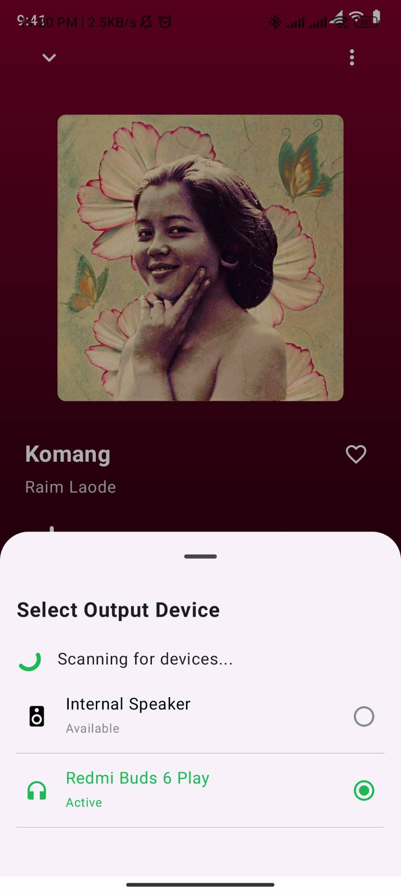
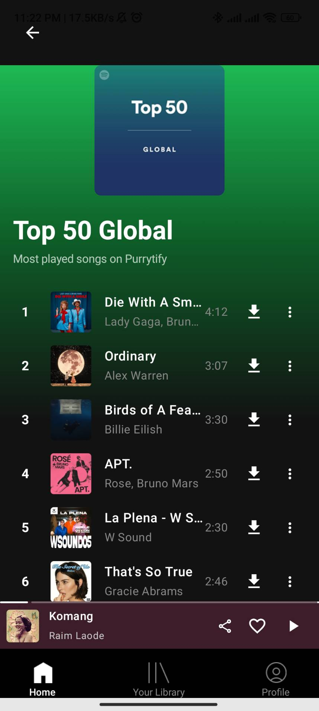
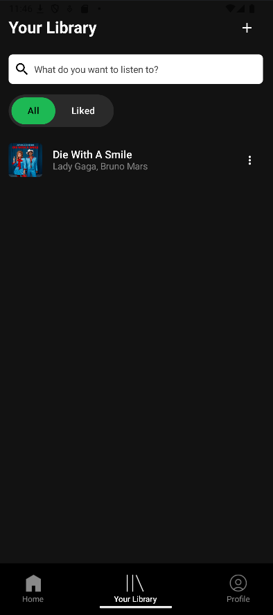
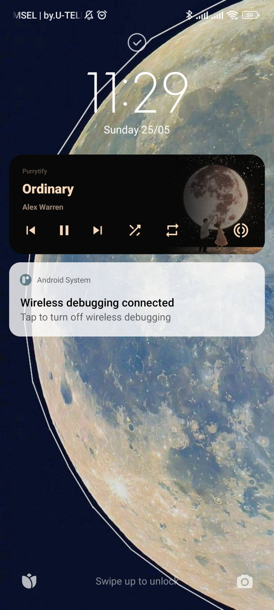
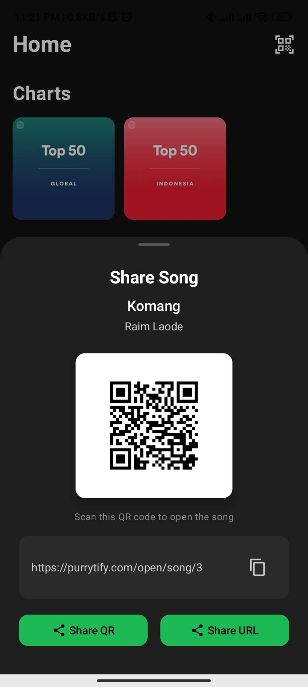
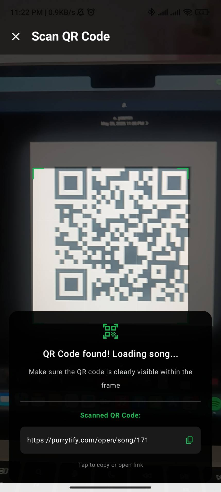
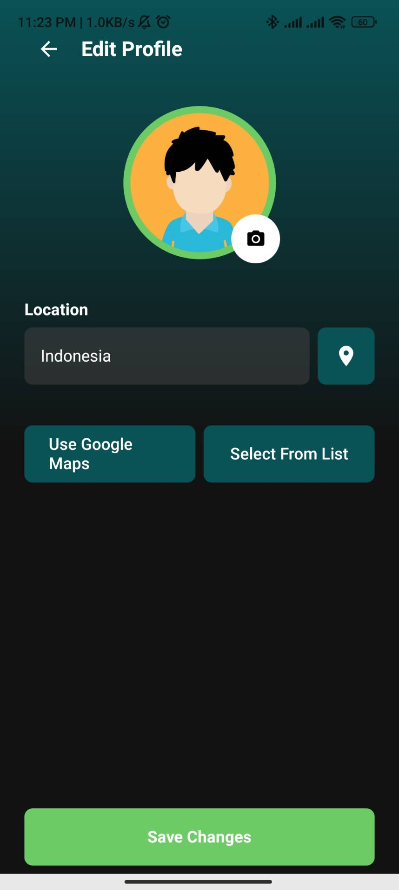
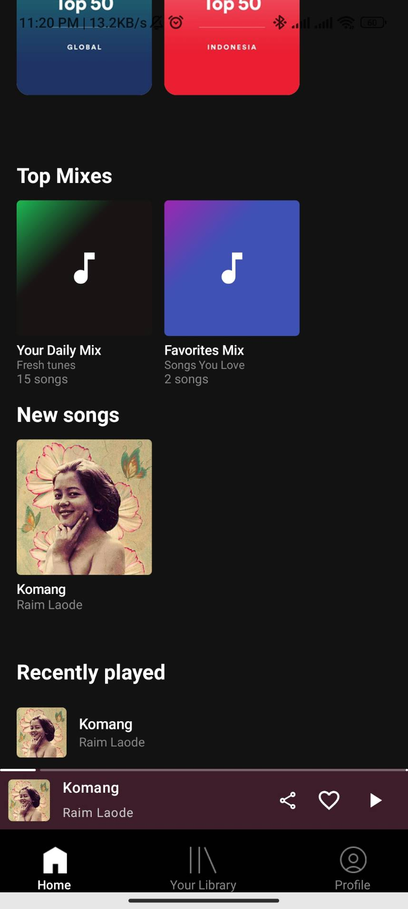
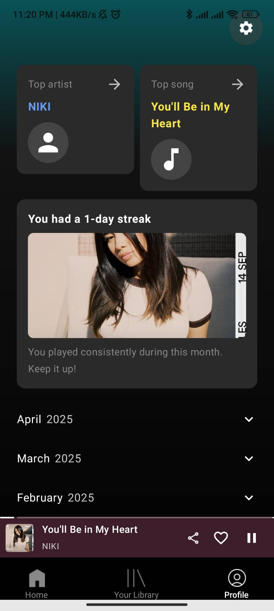

# Purrytify

> **Tugas Besar IF3210 - Pengembangan Aplikasi Piranti Bergerak**

Purrytify is a music player application developed as the final project for the Mobile Application Development course (IF3210) at Institut Teknologi Bandung. This Android application provides a comprehensive music player experience with features for music playback, library management, and user authentication.


## Table of Contents

1. [Overview](#overview)
2. [Features](#features)
3. [Tech Stack](#tech-stack)
4. [Setting Up](#setting-up)
5. [Screenshots](#screenshots)
6. [Task Allocation](#task-allocation-)
7. [OWASP Security Analysis](#owasp-security-analysis)
8. [Acknowledgements](#acknowledgements)

## Overview

The Purrytify project focuses on developing a music player Android application that allows users to listen to, manage, and share their music libraries. The application provides a comprehensive set of features including user authentication, music playback, library management, and profile handling.

### Milestone 1 Objectives

- Building an interactive and intuitive music player interface for Android
- Implementing local storage for songs and their metadata
- Creating user authentication with JWT token management
- Developing background services for continuous music playback
- Building a comprehensive library management system
- Implementing network sensing and offline capabilities

### Milestone 2 Objectives

- Enhancing audio experience through customizable audio routing and device selection
- Extending music availability with online song streaming and download capabilities
- Improving music sharing through URL and QR code integration
- Creating a responsive design that adapts to various screen sizes and orientations
- Adding personalized recommendations based on user preferences and listening history
- Implementing advanced features like sound capsule creation and notification controls

## Features

### Header dan Navbar

- Three navigation menus: Home, Library, and Profile
- Visual indication for active menu
- Dynamic header based on current menu

### Login

- Authentication system with JWT token management
- Secure token storage using EncryptedSharedPreferences
- API integration with backend server

### Home

- Recently played songs display
- New uploads section
- Single-tap playback functionality

### Library

- All Songs view with complete song collection
- RecyclerView implementation for efficient list handling
- Song playback on selection

### Play Songs

- Full player view with detailed song information
- Play/pause, next/previous functionality
- Duration tracking with seekable progress bar
- Mini player for continuous playback while browsing

### Add Songs

- Song upload from external storage
- Metadata extraction using MediaMetadataRetriever
- Form for editing song details (title, artist, artwork)
- Room Database storage for song metadata

### Profile

- User profile data display
- Statistics for uploaded songs, liked songs, and listened songs
- Settings and account management

### Liked Songs

- Like/unlike functionality for songs
- Dedicated section for liked songs in Library
- Synchronized status across the application

### Background Service

- JWT expiration checking
- Automatic token refresh
- Persistent music playback

### Network Sensing

- Internet connectivity detection
- Offline mode support
- User notifications for connection status

## Milestone 2 Features

### Audio Routing and Output Device Selection

- Audio output device discovery (built-in speaker, Bluetooth, wired headset)
- Real-time device connection/disconnection detection
- Device selection dialog with visual device type indicators
- Automatic fallback to available devices when the current device disconnects
- Persistent device selection across app sessions

### Online Songs

- Browse and stream music from remote server
- Buffering indicators for loading songs
- Integration with existing player UI
- Continuous playback even when navigating between screens

### Download Online Songs

- Download functionality for offline listening
- Download progress indicator
- Download management (pause/resume/cancel)
- Storage optimization and management

### Sound Capsule & Export

- Create and save custom sound snippets
- Audio trimming with visual waveform representation
- Export audio segments in various formats
- Share sound capsules with other users

### Notification Controls

- Media notification with song information
- Playback controls in notification area (play/pause, next/previous)
- Album artwork display in notification
- Lock screen media controls

### Share Songs via URL

- Generate shareable links for songs
- Deep linking support for direct song access
- Social media integration
- Copy-to-clipboard functionality

### Share Songs via QR

- QR code generation for song sharing
- Scanner integration for receiving shared songs
- Visual confirmation of successful shares
- History of shared content

### Halaman Responsive

- Dynamic layout adjustments for different screen sizes
- Orientation change support (portrait/landscape)
- Adaptive components for various device densities
- Consistent UX across different Android devices

### Edit Profile

- User profile image upload and editing
- Display name and bio customization
- Password change functionality
- Profile visibility settings

### Rekomendasi Lagu

- Personalized song recommendations based on listening history
- Genre-based recommendation categories
- "Discover Weekly" style playlist generation
- Similar artist and song suggestions

## Spesifikasi Bonus

### Queue

- Add to queue functionality
- Custom playback order
- Queue management

### Shuffle

- Random song playback
- Toggle functionality

### Repeat

- Multiple repeat modes (off, repeat all, repeat one)
- Persistent repeat settings

### OWASP

- Security analysis and improvements
- Implementation of best practices

### Pencarian

- Search functionality in Library
- Filtering by song title and artist
- Real-time results

### Accessibility Testing

- Accessibility Scanner implementation
- UI improvements for better accessibility
- Support for users with disabilities

## Tech Stack

### Milestone 1
- **Language:** Kotlin
- **Storage:** Room Database for song metadata
- **UI Components:** RecyclerView, Navigation Components
- **Media Handling:** MediaPlayer, MediaMetadataRetriever
- **Networking:** Retrofit/OkHttp for API requests
- **Token Management:** EncryptedSharedPreferences
- **Background Processing:** Services and BroadcastReceivers

### Milestone 2
- **Audio Management:** AudioManager, BluetoothAdapter
- **Media Session:** MediaSession, NotificationCompat.MediaStyle
- **Data Sharing:** Intent, ContentProvider, FileProvider
- **Image Processing:** ZXing for QR code generation and scanning
- **Download Management:** DownloadManager
- **Audio Processing:** AudioTrack, WaveformView
- **Responsive Design:** ConstraintLayout, MotionLayout
- **Recommendation Engine:** Collaborative filtering algorithm
- **Data Persistence:** DataStore for preferences

## Setting Up

To set up the Purrytify application:

1. Clone the repository

```sh
git clone https://github.com/Labpro-21/if3210-tubes-mad-2025-if3210-2025-mad-cat.git
```

2. Open the project in Android Studio

3. Build and run the application on a device or emulator with minimum API Level 29 (Android 10)

4. Use these credentials to log in:

```
Email: {your-nim}@std.stei.itb.ac.id
Password: {your-nim}
```

## Screenshots

### Authentication

<div style="display: flex; flex-wrap: wrap; gap: 10px;">
  
  
</div>

### Main Screens

<div style="display: flex; flex-wrap: wrap; gap: 10px;">
  
  
  
</div>

### User Profile

<div style="display: flex; flex-wrap: wrap; gap: 10px;">
  
  
</div>

### Music Player

<div style="display: flex; flex-wrap: wrap; gap: 10px;">
  
</div>

### Song Management

<div style="display: flex; flex-wrap: wrap; gap: 10px;">
  
  
  
</div>

### Other Features

<div style="display: flex; flex-wrap: wrap; gap: 10px;">
  
</div>

### Milestone 2 Features

<div style="display: flex; flex-wrap: wrap; gap: 10px;">
  
  
  
  
  
  
  
  
  
</div>

## Task Allocation

### Milestone 1

| Task                         | Responsible        |
| ---------------------------- | ------------------ |
| Login/Authentication         | 13522140           |
| Song Upload/Management       | 13522139, 13522140 |
| Home Screen                  | 13522140           |
| Library Screen               | 13522140           |
| Music Player                 | 13522140           |
| Mini Player                  | 13522140           |
| Profile Screen               | 13522140           |
| Room Database Implementation | 13522140           |
| JWT Background Service       | 13522121           |
| Network Sensing              | 13522139           |
| Liked Song                   | 13522121, 13522140 |
| User Management              | 13522139, 13522140 |
| Queue (Bonus)                | 13522139           |
| Shuffle (Bonus)              | 13522140           |
| Repeat (Bonus)               | 13522140           |
| OWASP (Bonus)                | 13522121           |
| Search (Bonus)               | 13522121, 13522139 |
| Accessibility Testing        |                    |

### Milestone 2

| Task                          | Responsible        |
| ----------------------------- | ------------------ |
| Audio Routing/Device Selection| 13522121           |
| Online Songs                  | 13522140           |
| Download Online Songs         | 13522140           |
| Sound Capsule & Export        | 13522139           |
| Notification Controls         | 13522140           |
| Share Songs via URL           | 13522140           |
| Share Songs via QR            | 13522140           |
| Responsive Pages              | 13522121           |
| Edit Profile                  | 13522140           |
| Song Recommendations          | 13522140           |

## Development Hours

### Milestone 1

| Name                      | NIM      | Hours |
| ------------------------- | -------- | ----- |
| Jonathan Emmanuel Saragih | 13522121 | 40    |
| Attara Majesta Ayub       | 13522139 | 50    |
| Yasmin Farisah Salma      | 13522140 | 90    |

### Milestone 2

| Name                      | NIM      | Hours |
| ------------------------- | -------- | ----- |
| Jonathan Emmanuel Saragih | 13522121 | 60    |
| Attara Majesta Ayub       | 13522139 | 60    |
| Yasmin Farisah Salma      | 13522140 | 60    |

## OWASP Security Analysis (Bonus 4)

### M4: Insufficient Input/Output Validation

We found a few potential security issues related to input validation in our app:

- The API responses from the server aren't always checked properly by the program
- When the user upload a song, users can enter any text for song titles and artist names
- The audio files from external storage could be corrupted and can damage the program

How to improve:

- Added validation for song titles and artist names (no empty fields, character limits)
- Added proper error handling for API responses with try-catch blocks
- Checking the audio files before uploading the song (correct format, size limits)
- Use Room's parameterized queries to prevent SQL injection

### M8: Security Misconfiguration

We identified these configuration issues in our initial implementation:

- HTTP connections instead of HTTPS
- Too many app permissions requested in the manifest
- Debug logs in production code
- Exposed components in the manifest

How to improve :

- Switched all API communication to HTTPS
- Removed unnecessary permissions and implemented runtime permission requests
- Added build variants to remove logs from release builds
- Protected sensitive components with proper permissions

### M9: Insecure Data Storage

There are several types of sensitive data that was handled in our program:

- User email and user profile
- Song history and liked songs
- JWT authentication tokens

How to improve the insecure storage :

- Not storing sensitive data in external storage or logs
- Clearing temporary files after use
- Using EncryptedSharedPreferences for token storage to improve security

## Acknowledgements

- Mobile Application Development Course Lecturer, Bandung Institute of Technology, 2025
- Mobile Application Development Teaching Assistants, Bandung Institute of Technology, 2025
