# Purrytify

> **Tugas Besar IF3210 - Pengembangan Aplikasi Piranti Bergerak**

Purrytify is a music player application developed as the "Tugas Besar 1" for the Mobile Application Development course (IF3210) by Jonathan, Attara, and Yasmine. This Android application provides a comprehensive music player experience with features for music playback, library management, and user authentication.


## Table of Contents

1. [Overview](#overview)
2. [Features](#features)
3. [Tech Stack](#tech-stack)
4. [Setting Up](#setting-up)
5. [Screenshots](#screenshots)
6. [Task Allocation](#task-allocation)
7. [OWASP Security Analysis](#owasp-security-analysis)
8. [Acknowledgements](#acknowledgements)

## Overview

The Purrytify project focuses on developing a music player Android application that allows users to listen to, manage, and share their music libraries. This application is not just a simple music player but a symbol of resistance against the anti-music tyranny of Dr. Asep Spakbor! With advanced features and a comprehensive song collection, this app becomes the main weapon in the battle to restore happiness through musical notes.

The main objectives of the Purrytify project include:

- Building an interactive and intuitive music player interface for Android
- Implementing local storage for songs and their metadata
- Creating user authentication with JWT token management
- Developing background services for continuous music playback
- Building a comprehensive library management system
- Implementing network sensing and offline capabilities

## Features

### User Authentication

- Login system with JWT token management
- Secure token storage
- Automatic token refresh when expired
- User profile display

### Music Management

- Audio file selection and metadata extraction
- Artwork and metadata editing
- Song deletion
- Library organization

### Music Playback

- Play/Pause functionality
- Next/Previous track navigation
- Progress tracking with seek capability
- Mini-player for continuous playback while browsing
- Full player view with song details

### Library Organization

- All Songs view
- Recently played songs tracking
- Liked Songs collection
- New uploads section

### Additional Features

- Network connectivity detection
- Background service for JWT validity checking
- UserEmail-based song organization

## Tech Stack

- **Language:** Kotlin
- **Storage:** Room Database for song metadata
- **UI Components:** RecyclerView, Navigation Components
- **Media Handling:** MediaPlayer, MediaMetadataRetriever
- **Networking:** Retrofit/OkHttp for API requests
- **Token Management:** EncryptedSharedPreferences
- **Background Processing:** Services and BroadcastReceivers

## Setting Up

To set up the Purrytify application:

1. Clone the repository

```sh
git clone https://github.com/Labpro-21/if3210-tubes-mad-2025-if3210-2025-mad-cat.git
```

2. Open the project in Android Studio

3. Build and run the application on a device or emulator with minimum API Level 29 (Android 10)

4. Use these credentials to log in:

```
Email: {your-nim}@std.stei.itb.ac.id
Password: {your-nim}
```

## Screenshots

### Authentication

<div style="display: flex; flex-wrap: wrap; gap: 10px;">
  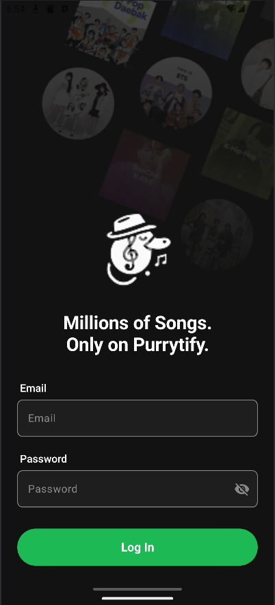
  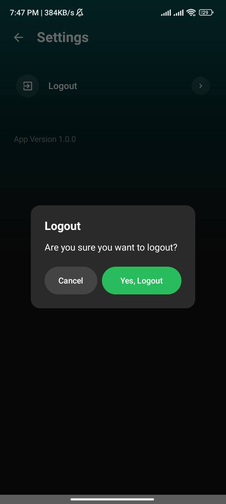
</div>

### Main Screens

<div style="display: flex; flex-wrap: wrap; gap: 10px;">
  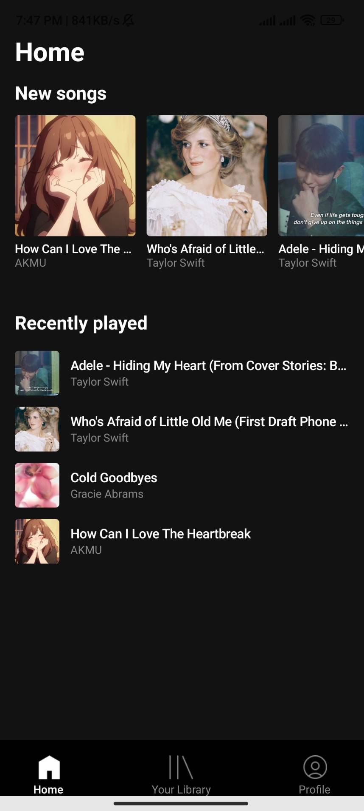
  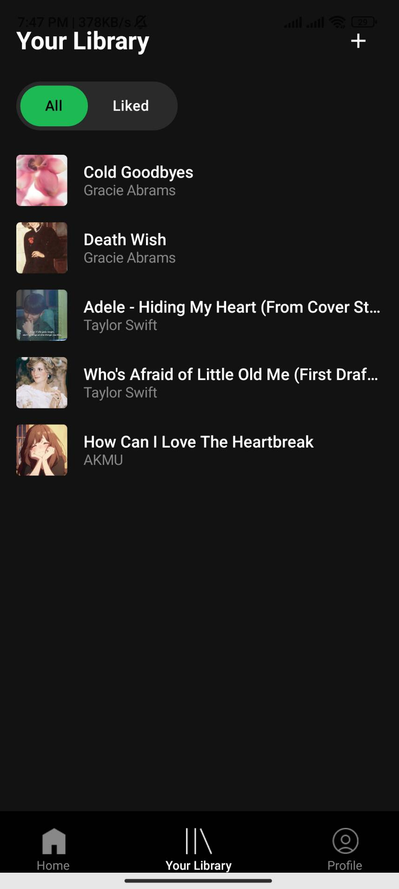
  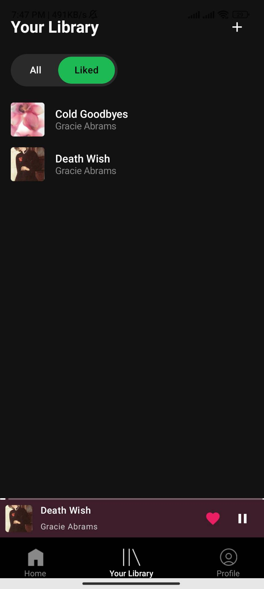
</div>

### User Profile

<div style="display: flex; flex-wrap: wrap; gap: 10px;">
  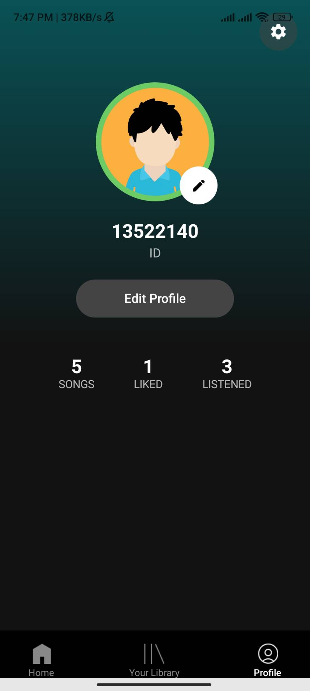
  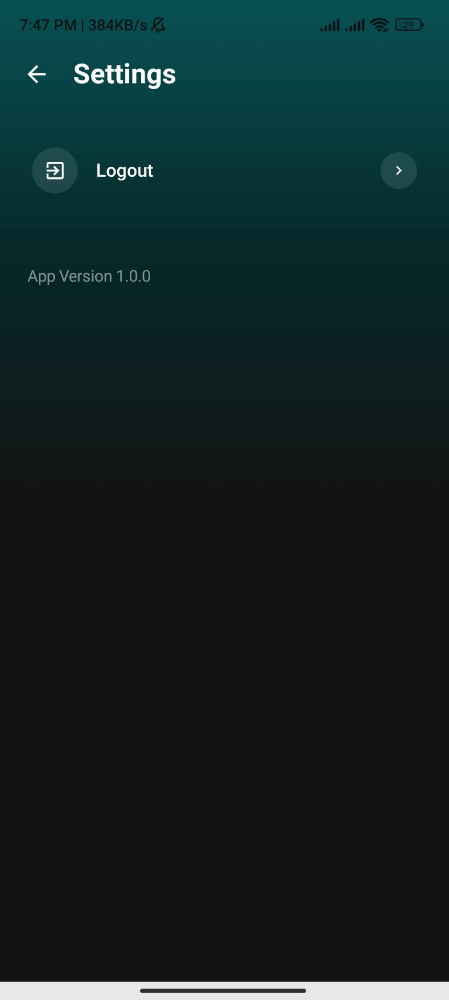
</div>

### Music Player

<div style="display: flex; flex-wrap: wrap; gap: 10px;">
  
</div>

### Song Management

<div style="display: flex; flex-wrap: wrap; gap: 10px;">
  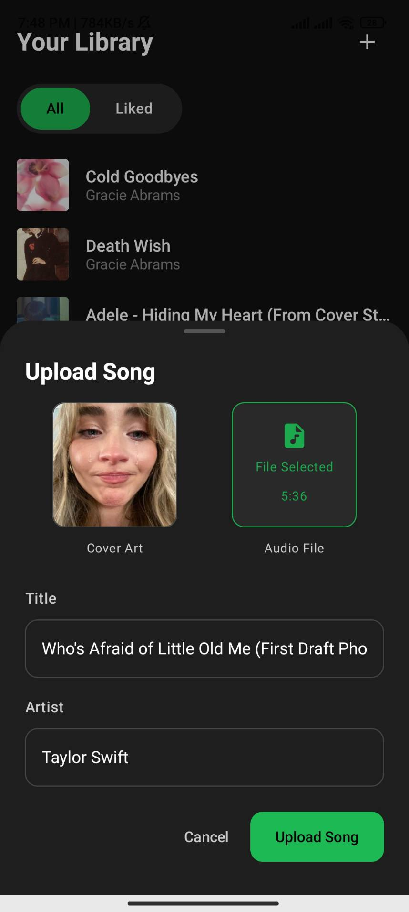
  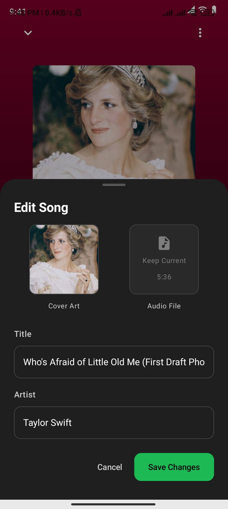
  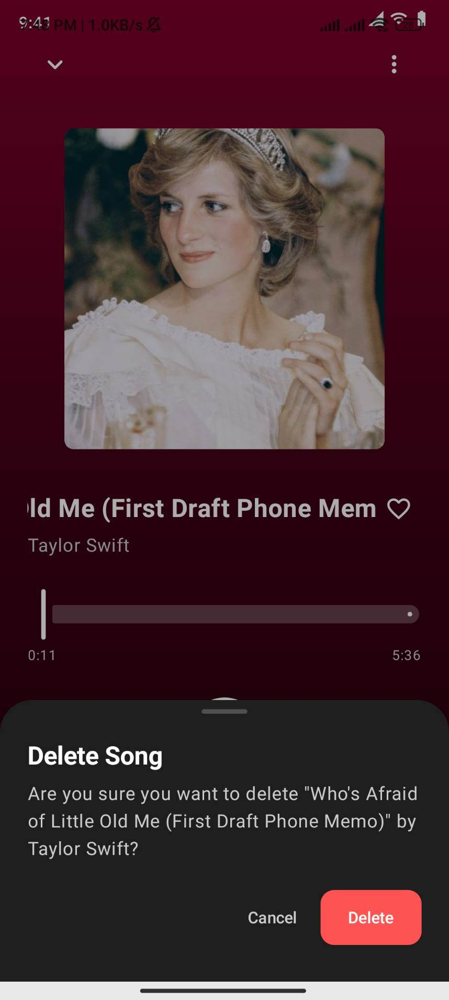
</div>

### Other Features

<div style="display: flex; flex-wrap: wrap; gap: 10px;">
  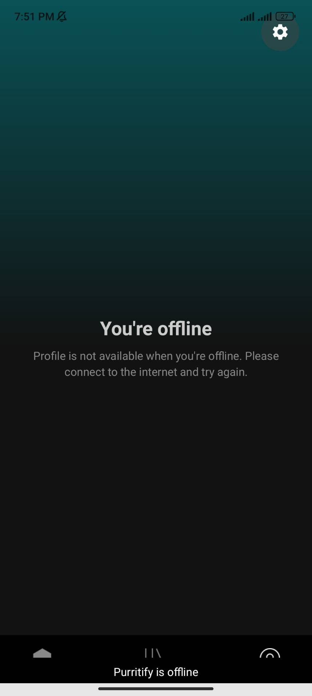
</div>

## Task Allocation

| Task                         | Responsible |
| ---------------------------- | ----------- |
| Login/Authentication         | 13522140    |
| Song Upload/Management       | 13522140    |
| Home Screen                  | 13522140    |
| Library Screen               | 13522140    |
| Music Player                 | 13522140    |
| Mini Player                  | 13522140    |
| Profile Screen               | 13522140    |
| Room Database Implementation | 13522140    |
| JWT Background Service       | 13522121    |
| Network Sensing              | 13522139    |
| Network Sensing              | 13522139    |
| Queue                        |             |
| Shuffle                      |             |
| Repeat                       |             |
| OWASP                        |             |
| Search                       |             |
| Accessibility Testing        |             |

## Development Hours

| Name                      | NIM      | Tasks | Hours |
| ------------------------- | -------- | ----- | ----- |
| Jonathan Emmanuel Saragih | 13522121 | 1     | 20    |
| Attara Majesta Ayub       | 13522139 | 1     | 20    |
| Yasmin Farisah Salma      | 13522140 | 8     | 40    |

## OWASP Security Analysis (Bonus 4)

### M4: Insufficient Input/Output Validation

We found a few potential security issues related to input validation in our app:

- The API responses from the server aren't always checked properly by the program
- When the user upload a song, users can enter any text for song titles and artist names
- The audio files from external storage could be corrupted and can damage the program

How to improve:

- Added validation for song titles and artist names (no empty fields, character limits)
- Added proper error handling for API responses with try-catch blocks
- Checking the audio files before uploading the song (correct format, size limits)
- Use Room's parameterized queries to prevent SQL injection

### M8: Security Misconfiguration

We identified these configuration issues in our initial implementation:

- HTTP connections instead of HTTPS
- Too many app permissions requested in the manifest
- Debug logs in production code
- Exposed components in the manifest

How to improve :

- Switched all API communication to HTTPS
- Removed unnecessary permissions and implemented runtime permission requests
- Added build variants to remove logs from release builds
- Protected sensitive components with proper permissions

### M9: Insecure Data Storage

There are several types of sensitive data that was handled in our program:

- User email and user profile
- Song history and liked songs
- JWT authentication tokens

How to improve the insecure storage :

- Not storing sensitive data in external storage or logs
- Clearing temporary files after use
- Using EncryptedSharedPreferences for token storage to improve security

## Acknowledgements

- Mobile Application Development Course Lecturer, Bandung Institute of Technology, 2025
- Mobile Application Development Teaching Assistants, Bandung Institute of Technology, 2025
