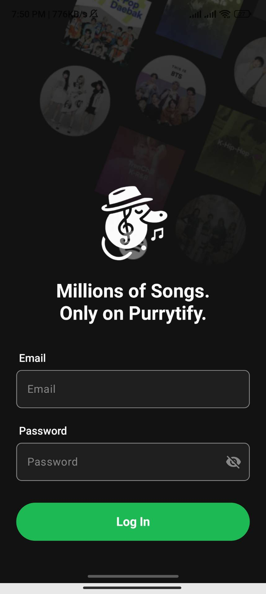
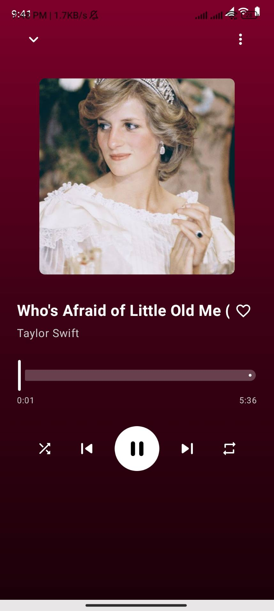

# Purrytify

> **Tugas Besar IF3210 - Pengembangan Aplikasi Piranti Bergerak**

> Purrytify is a music player application designed to bring music back to the world after Dr. Asep Spakbor's "Music-Erase-Inator" threatens to eliminate all music. As an agent of O.W.C.A. (Organisasi Warga Cool Abiez), your mission is to help Purry and his team return harmony to the world through this revolutionary app.


## Table of Contents

1. [Overview](#overview)
2. [Features](#features)
3. [Tech Stack](#tech-stack)
4. [Setting Up](#setting-up)
5. [Screenshots](#screenshots)
6. [Task Allocation](#task-allocation-📃)
7. [OWASP Security Analysis](#owasp-security-analysis)
8. [Acknowledgements](#acknowledgements)

## Overview

The Purrytify project focuses on developing a music player Android application that allows users to listen to, manage, and share their music libraries. This application is not just a simple music player but a symbol of resistance against the anti-music tyranny of Dr. Asep Spakbor! With advanced features and a comprehensive song collection, this app becomes the main weapon in the battle to restore happiness through musical notes.

The main objectives of the Purrytify project include:

- Building an interactive and intuitive music player interface for Android
- Implementing local storage for songs and their metadata
- Creating user authentication with JWT token management
- Developing background services for continuous music playback
- Building a comprehensive library management system
- Implementing network sensing and offline capabilities

## Features

### User Authentication
- Login system with JWT token management
- Secure token storage
- Automatic token refresh when expired
- User profile display

### Music Management
- Audio file selection and metadata extraction
- Artwork and metadata editing
- Song deletion
- Library organization

### Music Playback
- Play/Pause functionality
- Next/Previous track navigation
- Progress tracking with seek capability
- Mini-player for continuous playback while browsing
- Full player view with song details

### Library Organization
- All Songs view
- Recently played songs tracking
- Liked Songs collection
- New uploads section

### Additional Features
- Network connectivity detection
- Background service for JWT validity checking
- UserEmail-based song organization

## Tech Stack

- **Language:** Kotlin
- **Storage:** Room Database for song metadata
- **UI Components:** RecyclerView, Navigation Components
- **Media Handling:** MediaPlayer, MediaMetadataRetriever
- **Networking:** Retrofit/OkHttp for API requests
- **Token Management:** EncryptedSharedPreferences
- **Background Processing:** Services and BroadcastReceivers

## Setting Up

To set up the Purrytify application:

1. Clone the repository
```sh
git clone https://github.com/your-repo/purrytify.git
```

2. Open the project in Android Studio

3. Build and run the application on a device or emulator with minimum API Level 29 (Android 10)

4. Use these credentials to log in:
```
Email: {your-nim}@std.stei.itb.ac.id
Password: {your-nim}
```

## Screenshots

<div style="display: flex; flex-wrap: wrap; gap: 10px;">
  
  
  
  
  
</div>

## Task Allocation 📃

| Task | Responsible |
| ---- | ----------- |
| Login/Authentication | [Team Member] |
| Song Upload/Management | [Team Member] |
| Home Screen | [Team Member] |
| Library Screen | [Team Member] |
| Music Player | [Team Member] |
| Mini Player | [Team Member] |
| Profile Screen | [Team Member] |
| Room Database Implementation | [Team Member] |
| JWT Background Service | [Team Member] |
| Network Sensing | [Team Member] |

## Development Hours

| Name | NIM | Task | Hours |
| ---- | --- | ---- | ----- |
| [Team Member] | [NIM] | [Tasks] | [Hours] |
| [Team Member] | [NIM] | [Tasks] | [Hours] |
| [Team Member] | [NIM] | [Tasks] | [Hours] |

## OWASP Security Analysis

### M4: Insufficient Input/Output Validation
- **Analysis:** [Your analysis here]
- **Improvements:** [Your improvements here]

### M8: Security Misconfiguration
- **Analysis:** [Your analysis here]
- **Improvements:** [Your improvements here]

### M9: Insecure Data Storage
- **Analysis:** [Your analysis here]
- **Improvements:** [Your improvements here]

## Acknowledgements

- Mobile Application Development Course Lecturer, Bandung Institute of Technology, 2025
- Mobile Application Development Teaching Assistants, Bandung Institute of Technology, 2025
- O.W.C.A. for their continued support in the fight against Dr. Asep Spakbor's anti-music tyranny!
